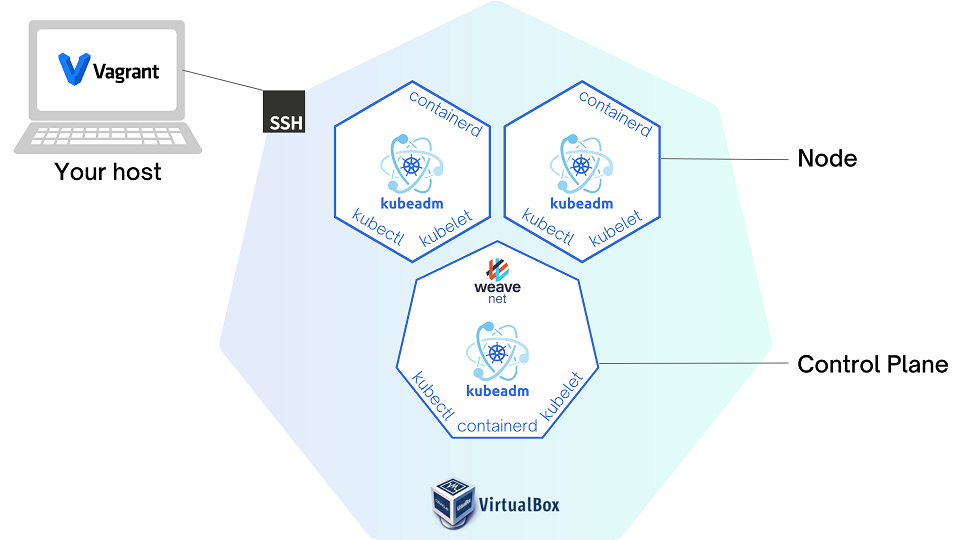

<h1 align="center">
 
  
   
     
  Xây dựng cụm Kubernetes bằng công cụ kubeadm trên Virtual Box
   
</h1>

<h4 align="center">🦖 Giải thích chi tiết từng bước cho người mới bắt đầu.</h4>

Tham khảo K8s documentation - mục <a href="https://kubernetes.io/docs/setup/production-environment/tools/kubeadm/" target="_blank">Bootstrapping clusters with kubeadm.</a> Hướng dẫn này sẽ dựng cụm Kubernetes trên máy tính cá nhân bằng cách sử dụng máy ảo Virtual Box. Chúng ta sẽ sử dụng phần mềm Vagrant để tự động hóa quá trình tạo máy ảo Virtual Box.

  <a href="https://www.vagrantup.com/" target="_blank">
    
  </a>
  <a href="https://www.virtualbox.org/" target="_blank">
    
  </a>
  <a href="https://kubernetes.io/" target="_blank">
    
  </a>
  <a href="https://containerd.io/" target="_blank">
    
  </a>
    <a href="https://opensource.org/licenses/MIT" target="_blank">
    
  </a>

 

    <b>LANGUAGE</b>

  
  

### Trước khi bắt đầu
* 🚧 Mô hình cụm: 1 máy Control Plan và 2 máy Node.
* 🖥️ Hệ điều hành: Ubuntu 18.04 LTS (Bionic Beaver)
* ⚙️ Tài nguyên hệ thống: 2 GB of RAM and 2 CPUs per machine.
* 📮 Mỗi máy sẽ có hostname, MAC address, và product_uuid riêng biệt.
* 🧱 Không thiết lập firewall. (Mặc định cho phép traffic ra vào các port)
* 🌐 Các máy trong cụm được kết nối mạng với nhau (private network, sử dụng network interface enp0s8 của các máy ảo).

### Hướng dẫn các bước

* ▶️ [Tạo máy ảo Virtual Box bằng Vagrant](docs/vi/Provision-VirtualBoxVM-with-Vagrant.md)
* ▶️ [Cài đặt container runtime (containerd) trên tất cả các máy ảo](docs/vi/Installing-a-container-runtime.md)
* ▶️ [Cài đặt kubeadm, kubelet và kubectl trên tất cả các máy ảo](docs/vi/Installing-kubeadm-kubelet-kubectl.md)
* ▶️ [Khởi động control plane và nodes](docs/vi/Boostrapping-control-plane-and-nodes.md)
* ▶️ [Dọn dẹp môi trường](docs/vi/Clean-up-environment.md)
