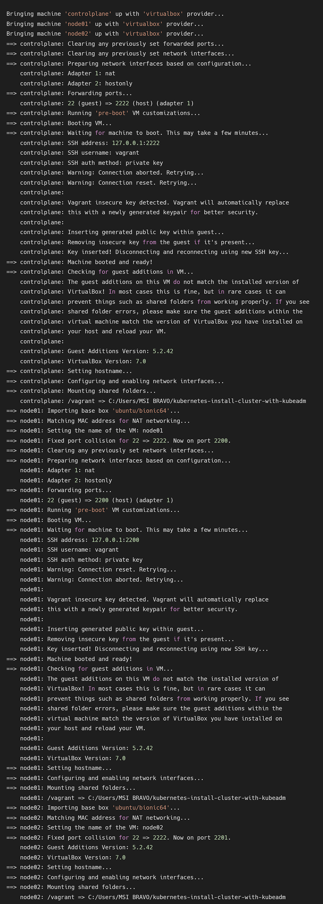
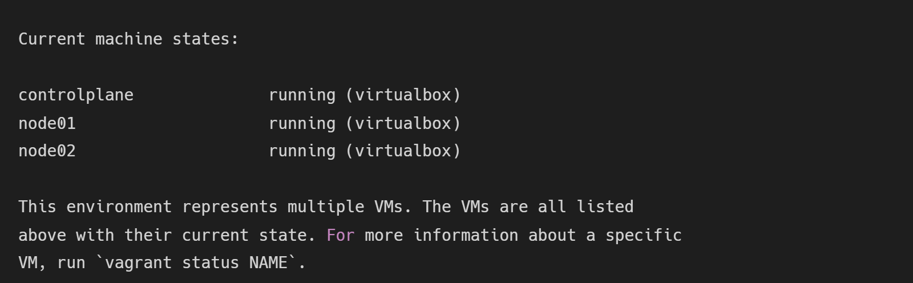
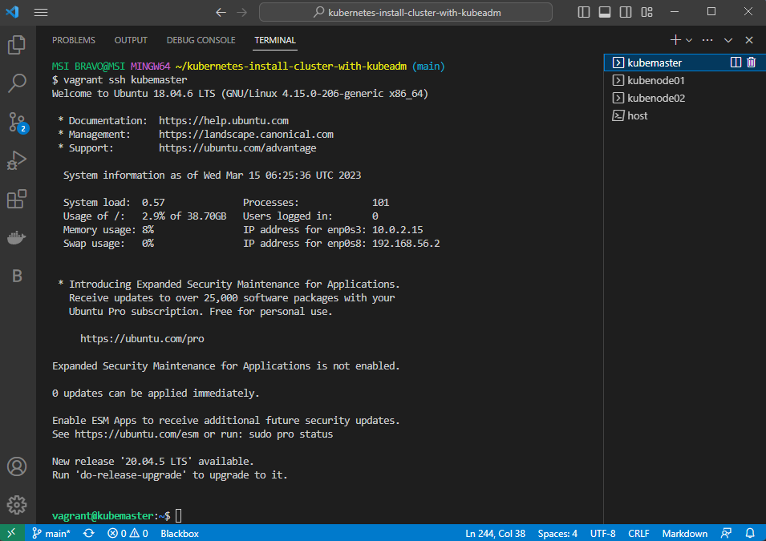

# Vagrant

- Website: [https://www.vagrantup.com/](https://www.vagrantup.com/)
- Source: [https://github.com/hashicorp/vagrant](https://github.com/hashicorp/vagrant)
- HashiCorp Discuss: [https://discuss.hashicorp.com/c/vagrant/24](https://discuss.hashicorp.com/c/vagrant/24)

`Vagrant` is a tool for creating and managing virtual machine environments. It is often considered a form of `Infrastructure as Code (IaC)`, as it allows us to define and manage our infrastructure using code. However, it is important to note that Vagrant is primarily a tool for managing virtual machine environments, and is not typically used for managing production infrastructure.

## Quick Start

For the quick-start, we'll bring up a development machine on `VirtualBox` because it is free and works on all major platforms.

First, download and install the [VirtualBox](https://www.virtualbox.org/wiki/Download_Old_Builds) and [Vagrant](https://www.vagrantup.com/downloads.html) on your host.

We will build our virtual environment from `Vagrantfile`. Clone this repo or just copy this [Vagrantfile](../Vagrantfile) to your current directory.

    # -*- mode: ruby -*-
    # vi:set ft=ruby sw=2 ts=2 sts=2:

    # Define the number of control plane (MASTER_NODE) and node (WORKER_NODE)
    NUM_MASTER_NODE = 1
    NUM_WORKER_NODE = 2

    IP_NW = "192.168.56."
    MASTER_IP_START = 1
    NODE_IP_START = 2

    # All Vagrant configuration is done below. The "2" in Vagrant.configure
    # configures the configuration version (we support older styles for
    # backwards compatibility). Please don't change it unless you know what
    # you're doing.
    Vagrant.configure("2") do |config|
    # The most common configuration options are documented and commented below.
    # For a complete reference, please see the online documentation at
    # https://docs.vagrantup.com.

    # Every Vagrant development environment requires a box. You can search for
    # boxes at https://vagrantcloud.com/search.
    # Here are some key details about the "ubuntu/bionic64" Vagrant box:
        # Operating System: Ubuntu 18.04 LTS (Bionic Beaver)
            # Ubuntu 18.04 LTS will receive security updates and bug fixes 
            # from Canonical, the company behind Ubuntu, until April 2023 
            # for desktop and server versions, and until April 2028 for 
            # server versions with Extended Security Maintenance (ESM) enabled.
        # Architecture: x86_64 (64-bit)
        # Disk Size: 10 GB
        # RAM: 2 GB
        # CPUs: 2
        # Desktop Environment: None (headless)
        # Provider: VirtualBox
    config.vm.box = "ubuntu/bionic64"

    # Disable automatic box update checking. If you disable this, then
    # boxes will only be checked for updates when the user runs
    # `vagrant box outdated`. This is not recommended.
    config.vm.box_check_update = false

    # View the documentation for the VirtualBox for more
    # information on available options.
    # https://developer.hashicorp.com/vagrant/docs/providers/virtualbox/configuration

    # Provision Control Plane
    (1..NUM_MASTER_NODE).each do |i|
        config.vm.define "kubemaster" do |node|
            node.vm.provider "virtualbox" do |vb|
                vb.name = "kubemaster"
                vb.memory = 2048
                vb.cpus = 2
            end
            node.vm.hostname = "kubemaster"
            node.vm.network :private_network, ip: IP_NW + "#{MASTER_IP_START + i}"
        end
    end

    # Provision Nodes
    (1..NUM_WORKER_NODE).each do |i|
        config.vm.define "kubenode0#{i}" do |node|
            node.vm.provider "virtualbox" do |vb|
                vb.name = "kubenode0#{i}"
                vb.memory = 2048
                vb.cpus = 2
            end
            node.vm.hostname = "kubenode0#{i}"
            node.vm.network :private_network, ip: IP_NW + "#{NODE_IP_START + i}"
        end
    end
    end

In this Vagrantfile, we simply specify: 
- Number of virtual machines: `NUM_MASTER_NODE`, `NUM_WORKER_NODE`
- IP address: `IP_NW`, `MASTER_IP_START`, `NODE_IP_START`
- Private networking connectivity: `node.vm.network`
- Unique hostname: `node.vm.hostname`
- Operating system: `config.vm.box`
- System resources: `vb.memory`, `vb.cpus`

The syntax of Vagrantfiles is [Ruby](https://www.ruby-lang.org/en/), but knowledge of the Ruby programming language is not necessary to make modifications to the Vagrantfile. See [here](https://developer.hashicorp.com/vagrant/docs/vagrantfile) for more information about Vagrantfile syntax.

## Start provisioning

Run the command:

    vagrant up

You can verify our provisioning VM by command:

    vagrant status

#### Issue: vagrant up times out on 'default: SSH auth method: private key' 

If you're using `Windows` and already have `Hyper-V`, you must disable Hyper-V to avoid conflict with `Virtual Box` which could lead to `vagrant up` time out. 

To disable `Hyper-V` completely, enter the following command:

    bcdedit /set hypervisorlaunchtype off

followed by system restart. 

>Note that `bcdedit` is short for `boot configuration data edit`, i.e. it affects what software will be loaded on the next OS boot, so it is essential that you perform a full boot from a complete power down (not a suspend and restart) in order for the changes to take effect. Leave the PC powered down for `10 seconds` before starting it again. If your PC does not offer a full shutdown from the start menu you could try running `shutdown /p` from an admin command prompt. On a laptop you may have to remove the battery.

Reinstall `Vagrant` & `Virtual Box`. If issue is still exist, you might have to reinstall `Windows OS`!

## Remote to virtual machine with Vagrant

Just run the commands: 

    vagrant ssh <hostname>

As you can see in the output of `vagrant up`, Vagrant had fowarded port 22 and generated keypairs for each machine without ssh configuration in `Vagrantfile`. 
For more information you can see [Vagrant Share: SSH Sharing](https://developer.hashicorp.com/vagrant/docs/share/ssh) and [Vagrantfile: config.ssh](https://developer.hashicorp.com/vagrant/docs/vagrantfile/ssh_settings).

Then you're good to go!
